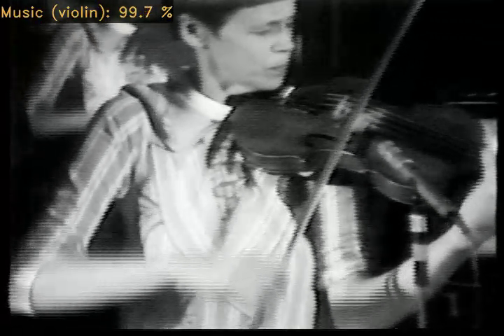

# MediaArtLiveArchive – Audio Tagging
[](https://opensource.org/licenses/MIT)

This repository contains a console application for tagging audio tracks of videos using a [CNN14](https://github.com/qiuqiangkong/audioset_tagging_cnn) convolutional neural network trained on a dataset of works by Steina and Woody Vasulka.  
The model trained on the Vasulka dataset can be downloaded [here](https://vasulkalivearchive.net/models/CNN14_Vasulka.zip).



### The model allows you to tag these categories:
| **Tag name**             | **F1-score** [%] |
|--------------------------|----------|
| Acoustic music        | 86.06    |
| Electronic music       | 91.15    |
| Violin playing          | 83.96    |
| Vocal Music            | 79.58    |
| Noise                    | 93.39    |
| Air (noise)              | 78.55    |
| Car (noise)              | 77.04    |
| Fire (noise)             | 96.55    |
| Water (noise)            | 86.79    |
| Speech                   | 93.39    |


### Running the console application
Example 1 – Tagging one video
```
python audio_tagging.py --video_path "path/to/video/video.mp4"
```
Example 2 – Tagging multiple videos contained in one folder
```
python audio_tagging.py --video_path "path/to/videos"
```

### audio_tagging.py arguments
<div markdown="block" style="overflow-x: scroll;">  

| argument| description| type|default|
|---|---|---|---|
| `--video_path` |path to a video or videos for tagging|str|"path/to/videos/"|
|`--model_path`| path to a pre-trained audio tagging model|str|"model/CNN14_Vasulka.pth"|
|`--tag_names`|  tag names used by the model|str|"pretrained/tag_names.txt"|
|`--output_path`|output path for predicitions|str|"output/"|
|`--gpu_predict`|if True, tagging will run on a GPU|bool|False|
|`--gpu_encode`|if True, video encoding will run on a GPU|bool|False|
|`--save_video`|if True, a video with rendered tags will be created|bool|False|
|`--video_bitrate`|if None, a default bitrate will be set|int|None|
|`--plot_predict`|if True, prediction plot will be saved|bool|False|
|`--skip_videos`|list of videos to skip in video_path|str|[]|

</div>
  
### Dependencies
```
matplotlib==3.3.3
numpy==1.19.5
opencv_python==4.5.1.48
moviepy==1.0.3
torchlibrosa==0.0.4
tqdm==4.61.1
torch==1.5.0+cu101
librosa==0.8.0
```
### Reference
This repository uses the [CNN14](https://github.com/qiuqiangkong/audioset_tagging_cnn) model proposed in:  
Kong, Q., Cao, Y., Iqbal, T., Wang, Y., Wang, W., & Plumbley, M. D. (2020). *PANNs: Large-Scale Pretrained Audio Neural Networks for Audio Pattern Recognition. IEEE/ACM Transactions on Audio, Speech, and Language Processing*, *28*, 2880–2894. https://doi.org/10.1109/taslp.2020.3030497

### Cite
Miklanek, S. (2022). *MediaArtLiveArchive – Audio Tagging* [Software]. https://github.com/vasulkalivearchive/audio

### Acknowledgements
The MediaArtLiveArchive – Audio Tagging software was implemented with the financial participation of the Technical Agency of the Czech Republic under the ÉTA programme. It is an output of the project Media Art Live Archive: Intelligent Interface for Interactive Mediation of Cultural Heritage (No. TL02000270). 

[](https://www.tacr.cz/)
